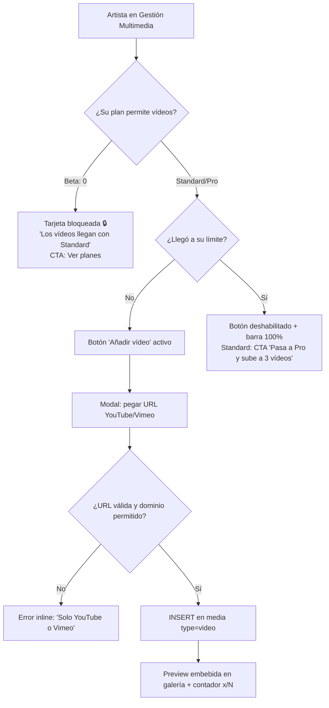
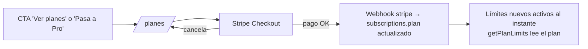

# TUESDI — Especificación de Planes y Vídeos
*Preparado: 05-jul-2026 · Estado: DISEÑO (no activado en la web) · Basado en el código real en producción*

---

## 1. Estado actual (verificado en el código)

| Concepto | Realidad hoy |
|---|---|
| Límites por plan | `PLAN_LIMITS` en `client/src/lib/constants.ts` |
| Beta (gratis) | 1 foto · **0 vídeos** |
| Standard (6€/mes) | 3 fotos · 1 vídeo |
| Pro (9,99€/mes) | 3 fotos · 3 vídeos |
| Fotos | Subida real a Storage (`artist-media`), máx. 5 MB, comprimidas en cliente |
| **Vídeos** | **NO se suben: son enlaces externos** (se pega una URL en `GestionMedia`) |
| Cobro | Stripe integrado en modo test, sin activar. Plan actual del artista en `subscriptions` |
| Nombres de plan | **Fijos e innegociables:** Beta / Standard / Pro |

> Implicación: "subir vídeos según el plan" es hoy "número de enlaces de vídeo
> según el plan". Antes de activar planes hay que decidir si eso basta o si se
> implementa subida nativa.

---

## 2. Decisión de arquitectura: ¿cómo deben ser los vídeos?

### Opción A — Enlaces externos (YouTube/Vimeo), como ahora
- ✅ Coste de almacenamiento y ancho de banda: **0€**
- ✅ Ya implementado y funcionando; el artista suele tener ya su canal
- ✅ El player de YouTube/Vimeo es mejor que cualquier cosa casera (calidad adaptativa, subtítulos)
- ❌ Depende de plataformas de terceros (anuncios de YouTube, branding ajeno)
- ❌ Sensación menos "premium" para un plan de pago
- **Score: 8/10 para la fase actual**

### Opción B — Subida nativa a Supabase Storage
- ✅ Experiencia 100% TUESDI, sin anuncios ni marcas ajenas
- ✅ Control total (portada, recortes, privacidad)
- ❌ **Coste real y creciente**: un vídeo de 60s a 1080p ≈ 60–120 MB. Supabase
  cobra storage (~0,021$/GB/mes) y sobre todo **egress** (~0,09$/GB): 100
  reproducciones de un vídeo de 100 MB ≈ 10 GB de salida ≈ ~0,90$/vídeo/mes
- ❌ Sin transcodificación: un .mov de iPhone de 300 MB se serviría tal cual
  (lento en móvil). Hacerlo bien exige pipeline (Mux/Cloudflare Stream: desde
  ~10-15€/mes extra)
- ❌ Semanas de desarrollo + moderación de contenido subido
- **Score: 3/10 ahora · 7/10 con tracción e ingresos**

### Opción C — Híbrido: enlaces en todos los planes + subida nativa corta solo en Pro
- ✅ Diferenciador real para Pro ("tu vídeo de presentación, sin YouTube")
- ✅ Coste acotado si se limita duro (1 vídeo nativo, ≤60s, ≤80 MB)
- ❌ Dos sistemas que mantener; complejidad doble
- **Score: 6/10 — buena evolución para v2, no para el arranque**

### ✅ RECOMENDACIÓN: **Opción A ahora, C como evolución de Pro**
Trade-off: si eliges A renuncias a la experiencia premium sin YouTube, porque
en beta con ~0 ingresos el coste de egress y el pipeline de vídeo no se
justifican; el valor diferencial entre planes se consigue igual con el
**número de vídeos** (0/1/3). Cuando Pro tenga suscriptores de pago reales,
añadir el "vídeo de presentación nativo" (C) es un upgrade natural y cobrable.

---

## 3. Tabla maestra de planes (para activar)

| Característica | **Beta** (0€) | **Standard** (6€/mes) | **Pro** (9,99€/mes) |
|---|---|---|---|
| Perfil público completo | ✅ | ✅ | ✅ |
| Bandeja de solicitudes privada | ✅ | ✅ | ✅ |
| **Fotos en galería** | 1 | 3 | 3 |
| **Vídeos (enlace YouTube/Vimeo)** | 0 | 1 | 3 |
| Tamaño máx. por foto | 5 MB | 5 MB | 5 MB |
| Analítica | Básica (visitas) | Básica | **Avanzada** (fuentes, conversión) |
| Posición en directorio | Estándar | Estándar | Prioridad en su categoría* |
| Insignia de perfil | — | — | "Pro" discreta* |
| Soporte | FAQ | Email | Email prioritario |

\* Marcado con asterisco = no implementado aún; decidir si entra en el
lanzamiento o se pospone. **Ojo con el ADN:** "prioridad en directorio" debe
ser transparente (nunca vender como "los mejores artistas"; es visibilidad,
no ranking de calidad).

### Validaciones de vídeo (enlace) a implementar
| Regla | Valor | Dónde |
|---|---|---|
| Dominios permitidos | youtube.com, youtu.be, vimeo.com | Cliente + constraint/trigger en BD |
| Formato URL | https válida | Cliente (zod) |
| Nº máx. según plan | 0/1/3 | Cliente (ya existe) + **BD (falta — ver §6)** |

---

## 4. Flujo de subida/gestión de vídeo (según plan)

### Flujo de upgrade (cuando se active Stripe)

**Regla de downgrade (DECIDIDA · implementada en trigger `prune_media_on_plan_change`):**
los planes tienen validez mensual desde su activación. Al cambiar a un plan con
límites inferiores (cambio voluntario, cancelación o impago → beta), el contenido
que exceda el nuevo límite se **elimina automáticamente**, borrando primero los
elementos más antiguos y conservando siempre los más recientes (el último se
asume el más actual). Es definitivo y está recogido en las Condiciones de Uso
(sección 6), que recomiendan al artista conservar copias propias.

---

## 5. Pantallas y estados de UI

| # | Pantalla/Estado | Qué se ve | CTA |
|---|---|---|---|
| P1 | Galería · Beta | Sección vídeos con candado 🔒 y texto "Disponible desde Standard" | "Ver planes" |
| P2 | Galería · con hueco | Botón "Añadir vídeo" + contador `1/3` y barra de progreso | Añadir |
| P3 | Galería · en el límite | Botón deshabilitado, barra llena; en Standard, banner "Pasa a Pro (3 vídeos)" | Upgrade |
| P4 | Modal añadir vídeo | Campo URL + ayuda "Pega el enlace de YouTube o Vimeo" + preview al validar | Guardar |
| P5 | Error URL | Mensaje inline "Solo se admiten YouTube o Vimeo" | — |
| P6 | Perfil público | Vídeos embebidos (iframe lazy) tras las fotos | — |
| P7 | /planes | Tabla comparativa (la de §3) con el plan actual marcado | Elegir plan |
| P8 | Post-upgrade | Toast "Ya tienes N vídeos disponibles" al volver a la galería | — |

Nota de copy: mantener el lenguaje del ADN — "amplía tu escaparate", nunca
"desbloquea popularidad".

---

## 6. Huecos técnicos a cerrar ANTES de activar planes (checklist)

- [ ] **Límites solo en cliente (crítico):** hoy `videos.length >= limits.videos`
      se comprueba solo en el frontend. Un usuario con la consola puede
      insertar más. Falta **trigger en BD** que valide el límite según el plan
      de `subscriptions` (mismo patrón que el rate-limit de eventos, exento
      admin). *Norma: escribir la migración como archivo primero.*
- [ ] Constraint/validación de dominio de vídeo (youtube/vimeo) también en BD.
- [ ] Definir política de **downgrade** (propuesta en §4) e implementarla.
- [ ] Stripe: pasar de test a live; mapear priceId → plan en el webhook
      (verificar firma del webhook, ya corregido en su día).
- [ ] Decidir si "analítica avanzada" y "prioridad en directorio" entran en
      el lanzamiento de Pro o se marcan "próximamente" (no vender lo que no hay).
- [ ] Página /planes: actualizar la tabla a la versión de §3.
- [ ] Tests: añadir casos a `getPlanLimits.test.ts` si cambian los límites, y
      test del trigger de límite por plan.
- [ ] Email de bienvenida por plan (opcional, `send-welcome-email` ya existe).

---

## 7. Costes estimados (escenario enlaces, Opción A)

| Concepto | MVP/Beta | 100 artistas de pago |
|---|---|---|
| Storage fotos (5 MB × 3 × N) | Céntimos | ~1,5 GB ≈ despreciable |
| Vídeo (enlaces externos) | 0€ | 0€ |
| Stripe | 0€ fijo | ~1,5% + 0,25€ por cobro |
| **Total infra extra por planes** | **~0€** | **<5€/mes** |

(Si algún día se activa la Opción C —vídeo nativo Pro— presupuestar Mux o
Cloudflare Stream: desde ~10-15€/mes + consumo.)

---

## 8. Resumen ejecutivo

1. **Vídeos = enlaces** (YouTube/Vimeo) en todos los planes por ahora; la
   subida nativa se pospone a un futuro "Pro v2" con ingresos reales.
2. Diferenciación por plan: **1/0 → 3/1 → 3/3** (fotos/vídeos) + analítica
   avanzada en Pro.
3. El hueco crítico antes de activar: **hacer cumplir los límites en la BD**,
   no solo en el cliente.
4. Definida la política de downgrade respetuosa con el ADN (ocultar, no borrar).
5. Coste de activar los planes con este diseño: prácticamente cero.
